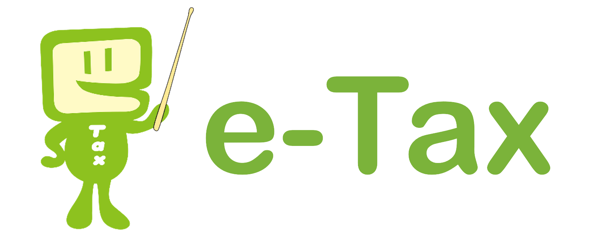

## e-Taxとは?
- 国税庁が管理する国税電子申請・納税システム
- 所得税・法人税・消費税などの申告・申請・届出を行うためのもの
## アカウント作成方法
- e-Taxのサイトで、 "[e-Tax利用開始届(個人用)](https://kaishi.e-tax.nta.go.jp/SU_APP/lnk/kaishiShinkiKojin)" を申請
- 上記の登録を行うと、e-Taxにログインするための"利用者識別コード"を取得できます。

[「README」に戻る](../README.md#時期別のイベントリスト)

## 提出した各書類の確認方法
- 手順
    1. e-Taxにログイン
    2. メニューのメッセージボックスの「お知らせ・受信通知」をクリック
    3. 提出済みの書類が表示されます
- 参考サイト
    - [マネーフォワードクラウド確定申告 e-Taxで受付結果を確認する方法](https://biz.moneyforward.com/support/tax-return/faq/documentation/20210429.html#ttl01)

[「freee会計で確定申告用の資料を作成する方法」に戻る](./freee.md#freee会計で確定申告用の資料を作成する方法)