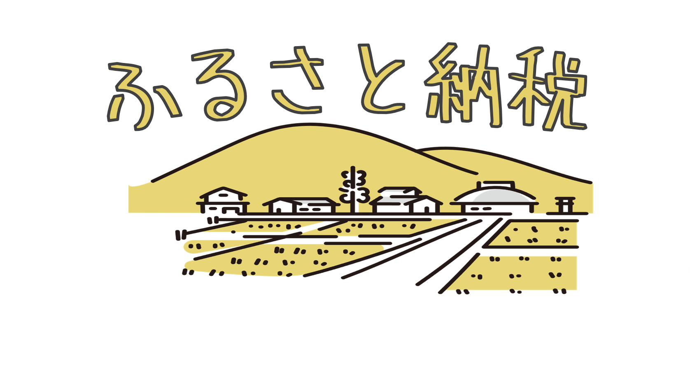

## ふるさと納税とは?
- 住民税や所得税をふるさと納税で納税しているイメージ
- 自分の手出しは、納税額を除くと2,000円のみであり、返礼品までもらえるので凄くお得

## ふるさと納税を行うメリット
- 実質負担2,000円で豪華な返礼品がもらえる
- 寄付額の一部が税金控除される（上限あり）
- 高額納税者ほど、ふるさと納税の上限額が多くなる
 
## オススメの返礼品
- 日用品
    - 理由 : 生活必需品を2,000円の手出しだけで多く得られるため
    - 例
        - [洗濯用洗剤 NANOX one](https://item.rakuten.co.jp/f122190-ichihara/56890374/?s-id=ph_pc_itemname)
        - [ティッシュ エリエール](https://item.rakuten.co.jp/f122190-ichihara/56890374/?s-id=ph_pc_itemname)
- 他にもいい返礼品があれば、教えてください。

## ふるさと納税の申し込みができるサイト
|サイト名|説明|
|:--|:--|
|[ふるさとチョイス](https://www.furusato-tax.jp/)|掲載自治体数No.1。様々な返礼品を比較できる|
|[さとふる](https://www.satofull.jp/)|申し込み手続きが簡単で、初心者向け|
|[楽天ふるさと納税](https://event.rakuten.co.jp/furusato/)|~~楽天ポイントが貯まり~~、楽天経済圏の人におすすめ ※ポイント還元は2025年10月で廃止|
|[ふるなび](https://furunavi.jp/)|Amazonギフト券の還元キャンペーンなどを実施|
|[au PAY ふるさと納税](https://furusato.wowma.jp/)|au PAYユーザーに特典あり|
|[ふるさと本舗](https://furusatohonpo.jp/)|返礼品の還元率が高いものが多い|