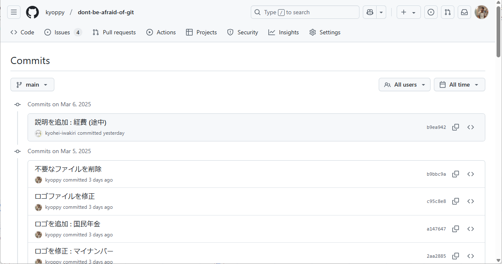
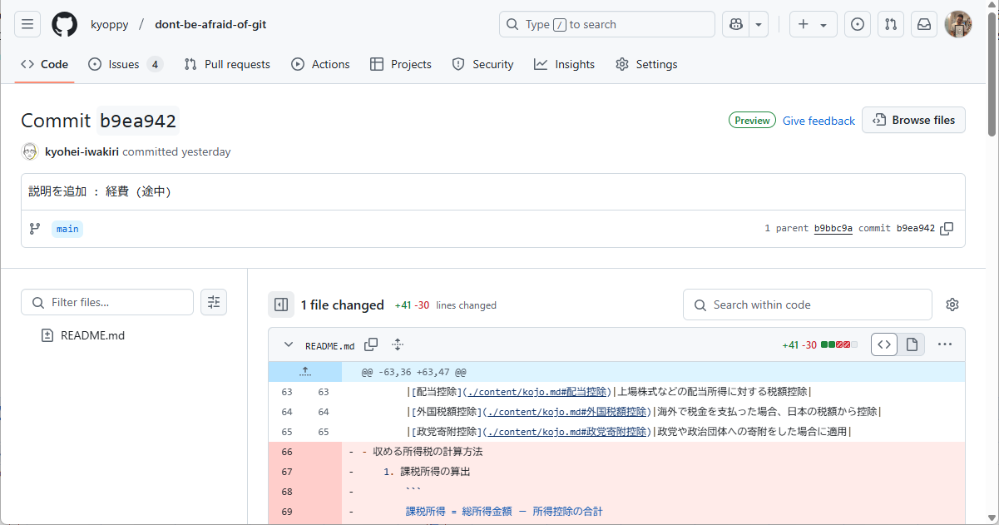
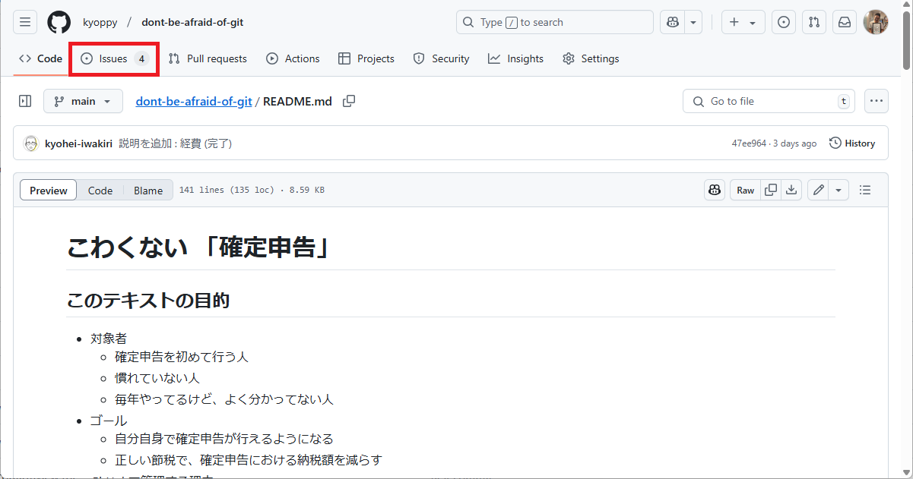
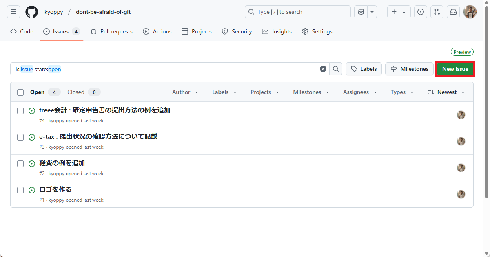
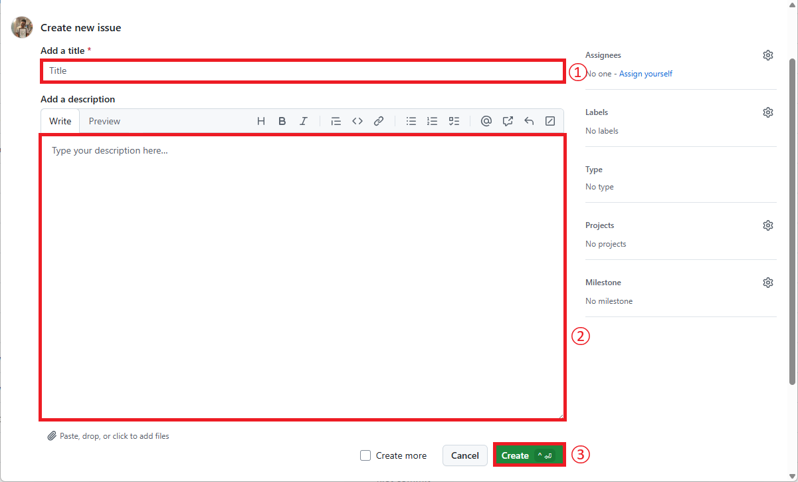
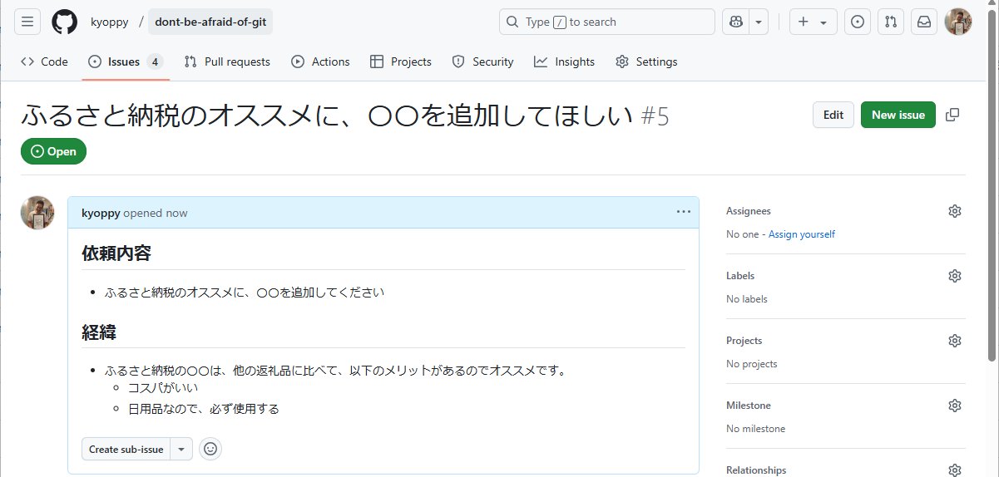

<picture width=100%>
  <!-- ダークモード用 -->
  <source srcset="../images/github_logo_dark.png" media="(prefers-color-scheme: dark)">
  <!-- ライトモード用 -->
  
</picture>

## GitHubの変更履歴を確認する方法
- 概要
  - 履歴は、更新日時が新しいものから上に表示されます。
- 手順
  1. コミットのタイトルをクリックします
    
  2. コミットの詳細が表示されます
    

[「README」に戻る](../README.md#その他)

## GitHubから改修を依頼する場合
- 概要
  - GitHubのIssues機能を用いて、改修依頼を行います
  - Issues機能を使用するためには、事前にGitHubのアカウントが必要になります。
    - 参考 : [GitHub アカウント作成](https://docs.github.com/ja/get-started/start-your-journey/creating-an-account-on-github#signing-up-for-a-new-personal-account)
  - 依頼内容はなるべく具体的にお願いします
- 手順
  1. ヘッダーメニューの「Issues」をクリックします
    
  2. 「New issue」ボタンをクリックします
    
  3. タイトル、詳細を入力し、「Create」ボタンをクリックします
    
    - 注意 : 詳細は以下のテンプレートを使用して入力してください。
      ```
      ## 依頼内容
      - ココに依頼内容を記載します。
      - 例 : ふるさと納税のオススメに、〇〇を追加してください
      ## 経緯
      - ココに依頼をした経緯を記載します。
      - 例 : ふるさと納税の〇〇は、他の返礼品に比べて、以下のメリットがあるのでオススメです。
        - コスパがいい
        - 日用品なので、必ず使用する
      ```
    - 詳細の見た目は、「Preview」をクリックすることで確認できます
  4. 作成した依頼が表示されます。
    
    - 注意 : 依頼を削除したい場合は、この画面の右下部にある「Delete issue」クリックして、削除してください
    
[「README」に戻る](../README.md#その他) 