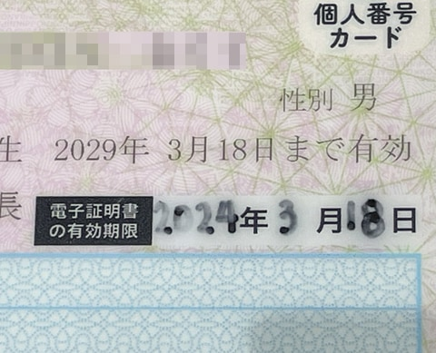

# マイナンバーカード

## マイナンバーカードの電子申請ができるかを確認する方法
- マイナンバーカードの右上の「電子証明書の有効期限」を確認する
    - イメージ図

        
- 電子証明書の有効期限を更新する方法
    - 更新できるタイミング : 有効期限が切れる3カ月前から更新可
    - 更新の手順
        1. 住民登録のある市区町村の窓口に行く
        2. 窓口でマイナンバーカードを提出
        3. マイナンバーカードに新しい電子証明書を書き込む
    - 更新に必要なもの
        - マイナンバーカード
    - 更新時の注意点
        - 市区町村によっては手続きの事前予約が必要な場合あり
        - 電子証明書の更新は、必ず窓口で行う必要あり (ネットでは不可)
        
[「README」に戻る](../README.md#時期別のイベントリスト)