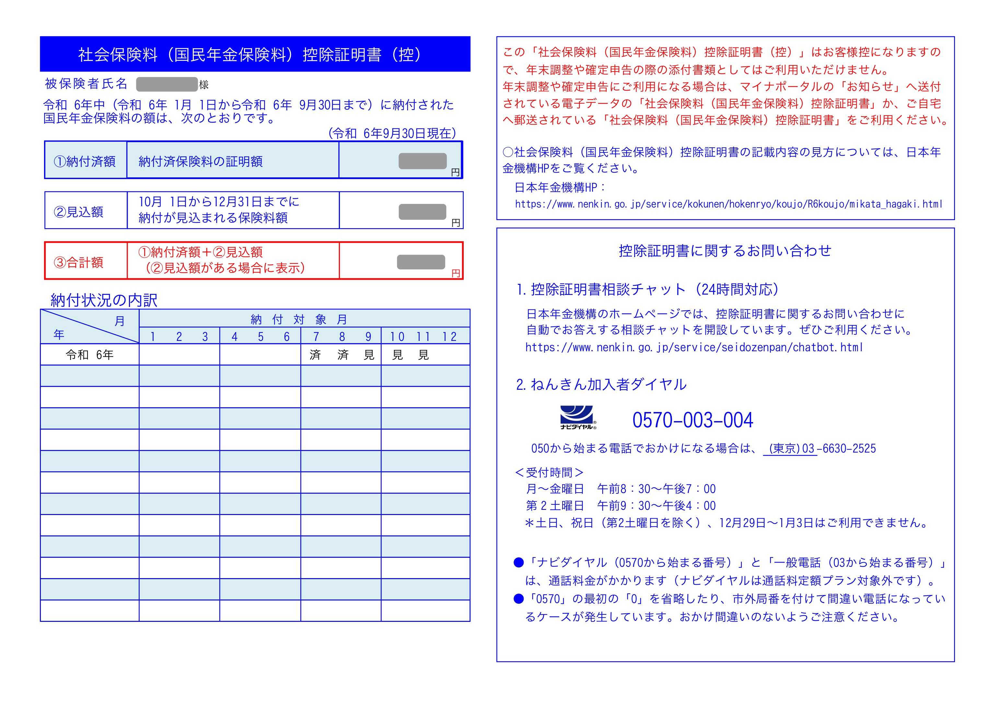

# 国民年金関連

## ねんきんネットとは ? 

## ねんきんネットのアカウント作成
- 参考 : [日本年金機構 マイナポータルからの利用登録方法](https://www.nenkin.go.jp/n_net/registration/mynaportal.html)

[「README」に戻る](../README.md#時期別のイベントリスト)

## ねんきんネットから控除証明書を発行する方法
- 概要
    - 社会保険料控除となる国民年金の控除証明書
    - 発行すべき時期 : 12月
- イメージ図

    
- 発行方法

[「README」に戻る](../README.md#時期別のイベントリスト)
